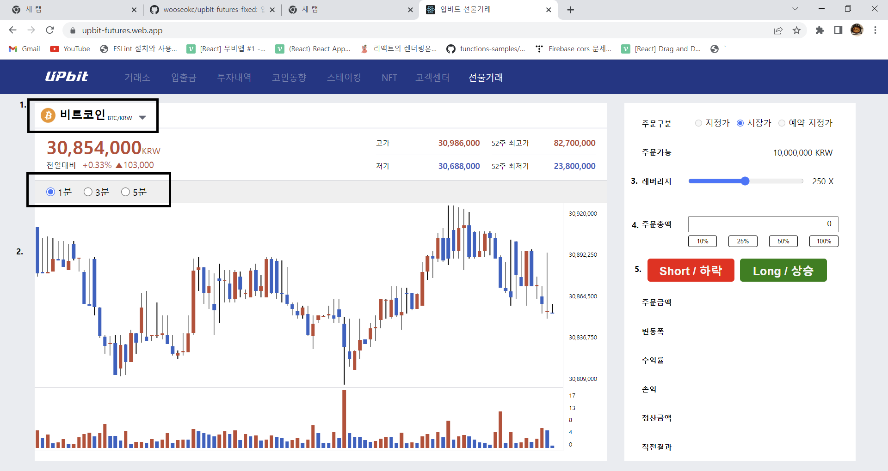

# 본 프로젝트는 배포가 완료된 프로젝트 입니다.
[https://upbit-futures.web.app/](https://upbit-futures.web.app/).

# 사용법

 
 
 1. 코인을 선택할 수 있습니다. 비트코인이나 이더리움 중 하나 고르세요

 2. 분봉을 택할 수 있습니다. 1분봉 3분봉 5분봉을 준비했습니다.

 3. 레버리지를 고르세요. 500배까지 가능합니다. 다만 -90%가 되면 청산되니까 주의하세요

 4. 주문 총액을 정하시면 됩니다.

 5. 베팅의 종류를 선택하세요. 숏은 하락 롱은 상승에 베팅하는 것입니다.

# 사용된 기술

 
 html5

 
 css3

 
 typescript

 
 react

 

 
 redux

 

 
 styledcomponents

  

# 배포 history

08.01 거래중 코인 변경할 때 거래가 끝나지 않던 버그 수정
 
08.03   1 스타일 컴포넌트 리팩토링
[관련 내용](https://wooseokc.github.io/single-project/upbitFuturesStyleRefactoring/).
  2 . InfoHeader 컴포넌트 파일이 부모 컴포넌트인 InfoSector 폴더가 아닌 상위 폴더에 있어서 수정
 
08.05 1 api호출로 받아오는 전역 상태 관리 방법 변경(to createAsyncThunk)